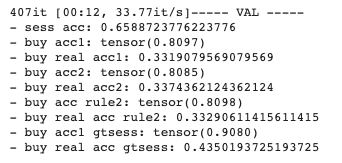
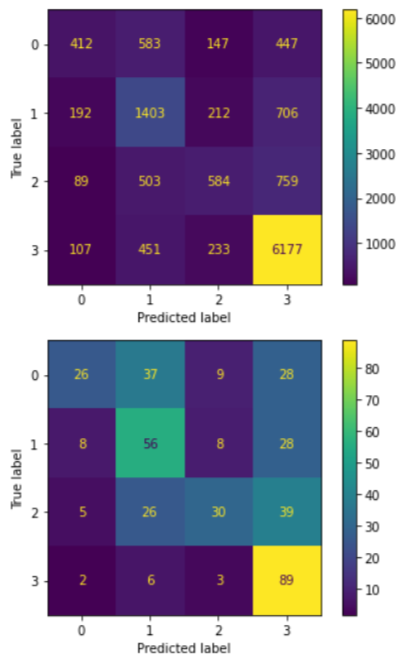
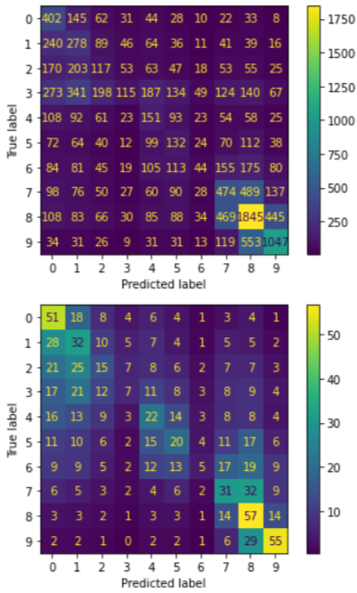
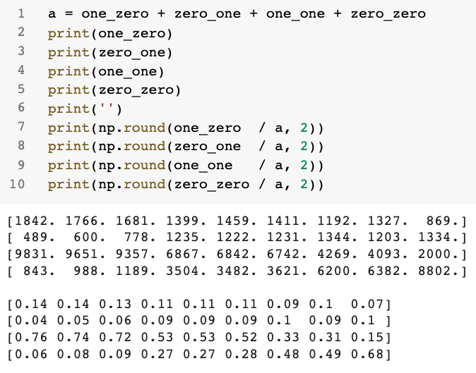
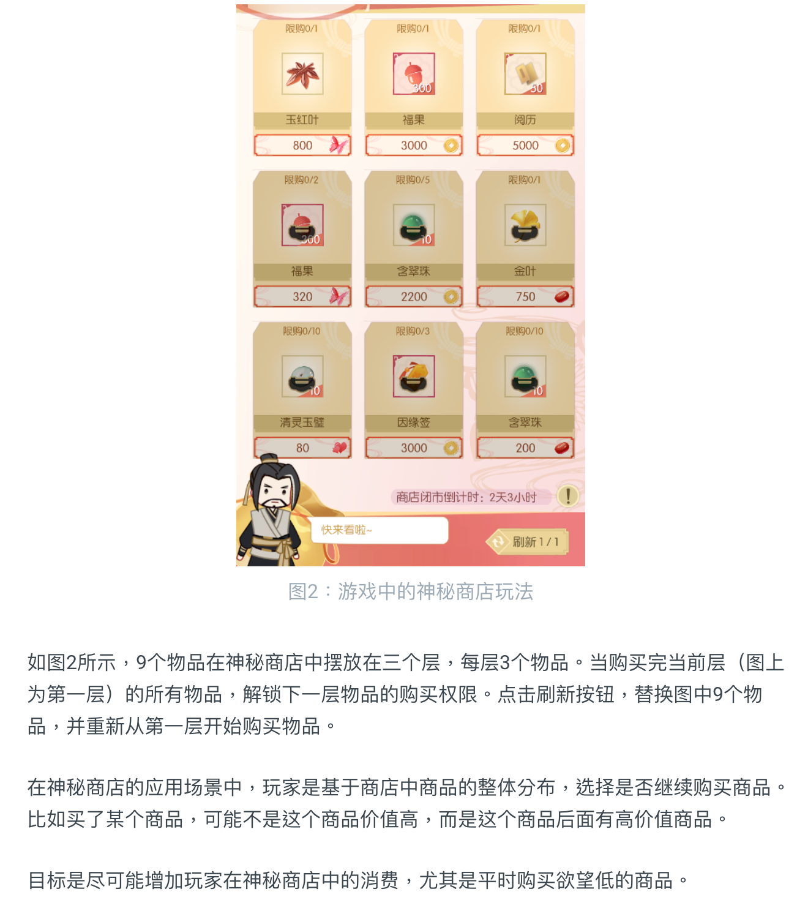
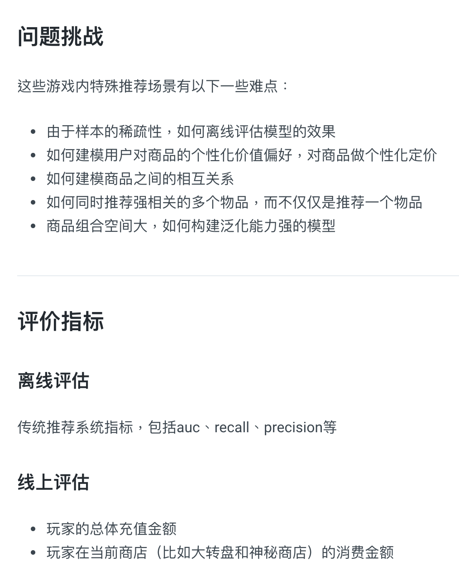

# README

### 2021.8.16 讨论

*   tta

    -   [x] 把同一个sess的物品打乱，然后分别过网络，再做平均

        | aug  | buy real acc2                                                |      |
        | ---- | ------------------------------------------------------------ | ---- |
        | no   | 0.36028                                                      |      |
        | 2    | 0.36281, 0.36089, 0.35997, 0.36178, 0.36204, 0.36063, 0.36304, 0.36158, 0.36086, 0.36292 |      |
        | 3    | 0.36500, 0.36465, 0.36319, 0.36074, 0.36143, 0.36139, 0.36508, 0.36342, 0.36139, 0.36342, 0.36081, 0.36419, 0.36350, 0.36170, |      |
        | 5    | 0.36217, 0.36400, 0.36350, 0.36431, 0.36347, 0.36224, 0.36158, 0.36231, 0.36216 |      |
        | 10   | 0.36020, 0.36262, 0.36258, 0.36201, 0.36216, 0.36216, 0.36208 |      |
        | 216  | 太多了，不试了                                               |      |

*   data aug

    -   [x] 把同一个sess的物品打乱（没有明显的提升，但还是默认加上了）

*   feature

    -   [x] 价格分桶，然后每个桶做 emb（貌似提升了一小点，不明显）

    *   预测 sess 多一个三个 sess (mean, sum, ...) pooling 后的 feature
    *   userclick pooling time decay (越接近权重越大)

*   模型：

    *   [x] Transformer（大概0.36 -> 0.365 的提升，还行，估计还能再升点，没继续训了，因为去搞multitask click了）
    *   GNN
    *   预测 click 数据，丰富了item之间的交互 （multitask, pretrain）

*   Loss：

    *   reweight loss (4种行为)

*   训得久一点：

    -   [x] 2epoch0.001adam -> 10epoch0.001adam+10epoch0.0001adam：0.33->0.36

### 一些模型分析

*   看一下，如果sess直接用gt，分数能有多少。
    *   如果 sess 有 gt（知道 0, 1, 2, 3）
        *   acc 会从 0.337 -> 0.435；新模型：0.36 -> 0.46
        *   单点的 acc 从 0.809 -> 0.908
    *   

*   sess prediction Confusion Matrix
    *   
*   cnt prediction confusion matrix
    *   
*   per item confusion numbers
    *   

### 一些信息

看起来是对应到了这里描述的“神秘商店”：[基于玩家实时交互的游戏道具推荐 - 伏羲实验室用户画像组开放课题 (gitbook.io)](https://fuxi-up-research.gitbook.io/open-project/research_topics/rl_based_recommendation)

