# EDA

## train.csv

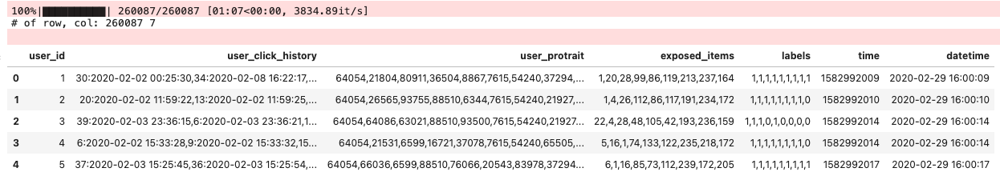


### User behavior study

#### Click

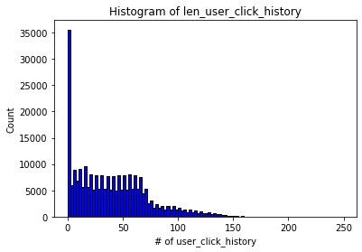

```shell
There are 28184 users have 0 click history
There are 3836 users have 1 click history
There are 3556 users have 2 click history
There are 3102 users have 3 click history
There are 2957 users have 4 click history
There are 2880 users have 5 click history
There are 2868 users have 6 click history
There are 3240 users have 7 click history
There are 3589 users have 8 click history
There are 3305 users have 9 click history
There are 3130 users have 10 click history
...
There are 662 users have 90 click history
There are 713 users have 91 click history
There are 659 users have 92 click history
There are 690 users have 93 click history
There are 623 users have 94 click history
There are 646 users have 95 click history
There are 667 users have 96 click history
There are 664 users have 97 click history
There are 620 users have 98 click history
There are 658 users have 99 click history
```


#### Bought

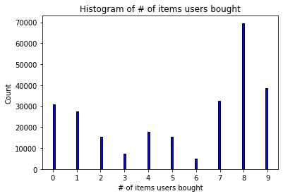

```
There are 30912 users have bought 0 items
There are 27620 users have bought 1 items
There are 15330 users have bought 2 items
There are 7317  users have bought 3 items
There are 17895 users have bought 4 items
There are 15486 users have bought 5 items
There are 4810  users have bought 6 items
There are 32512 users have bought 7 items
There are 69645 users have bought 8 items
There are 38560 users have bought 9 items
```

只买3个和6个的人很少，因为买完3或6个就会进入到下一个session


#### Session

```
bought 0   items: 30912 users
bought 1~3 items: 50267 users
bought 4~6 items: 38191 users
bought 7~9 items: 140717 users

exposed 3 items: 73862 users
exposed 6 items: 40698 users
exposed 9 items: 145527 users
```


### Item behavior study

| Session | Item IDs      | \# Clicks | \# Buys |
| ------- | ------------- | --------- | ------- |
| 1       | 1~39 (39)     | 4,606,977 | 80,231  |
| 2       | 40~147 (108)  | 3,608,173 | 63,297  |
| 3       | 148~381 (234) | 2,220,648 | 287,482 |


#### Click by session

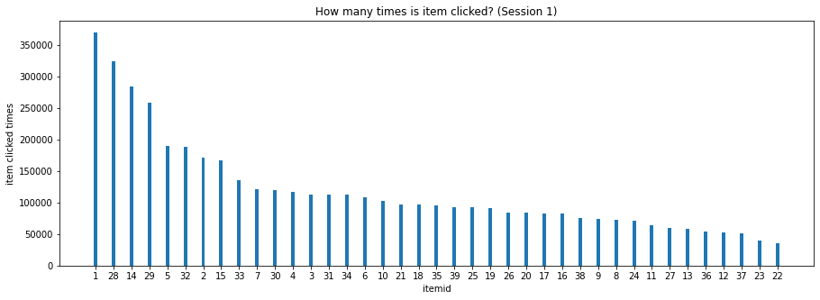

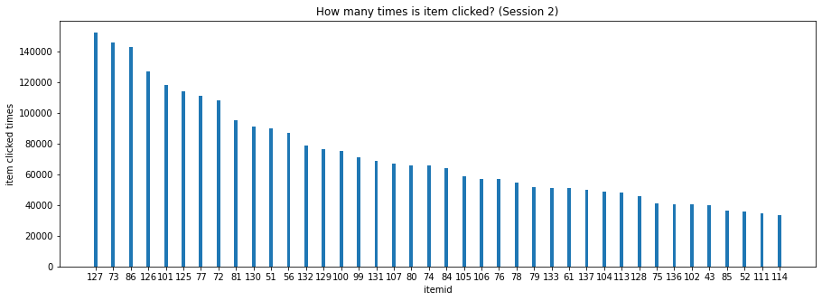

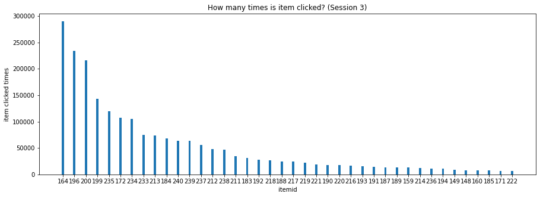


#### Expose by session

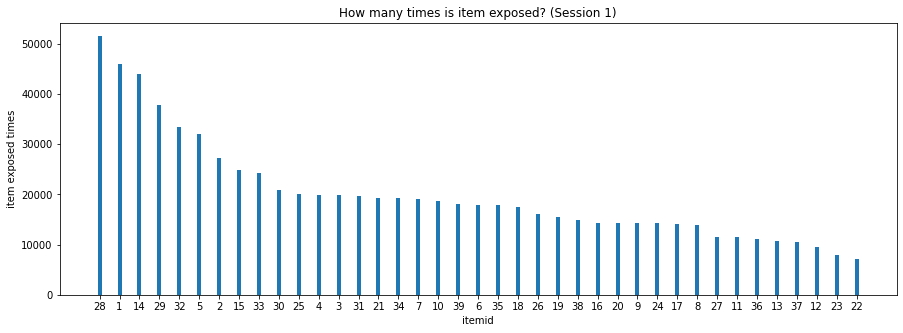

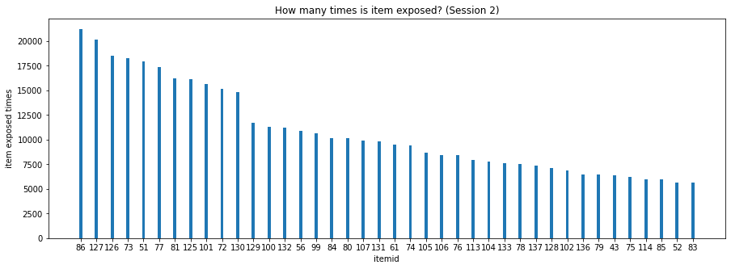

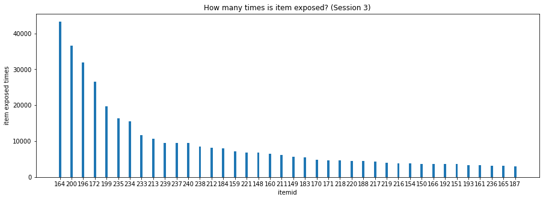


#### Bought by session

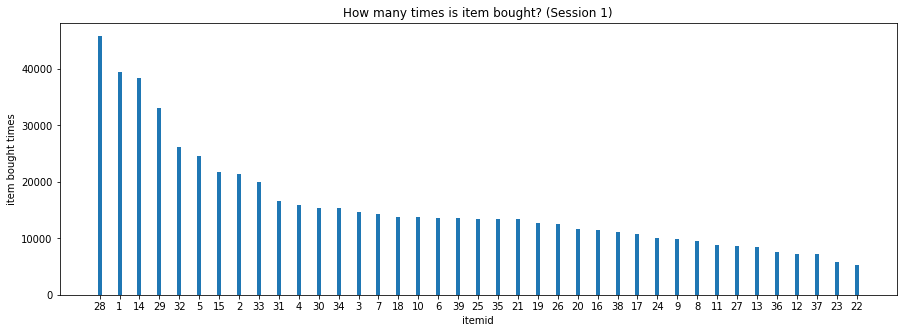

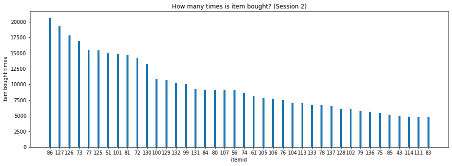


#### Bought vs Expose (expose只算到对应session的) by session

也就是，解锁到对应session的购买率

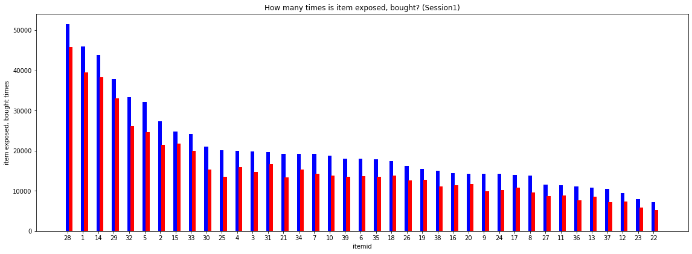

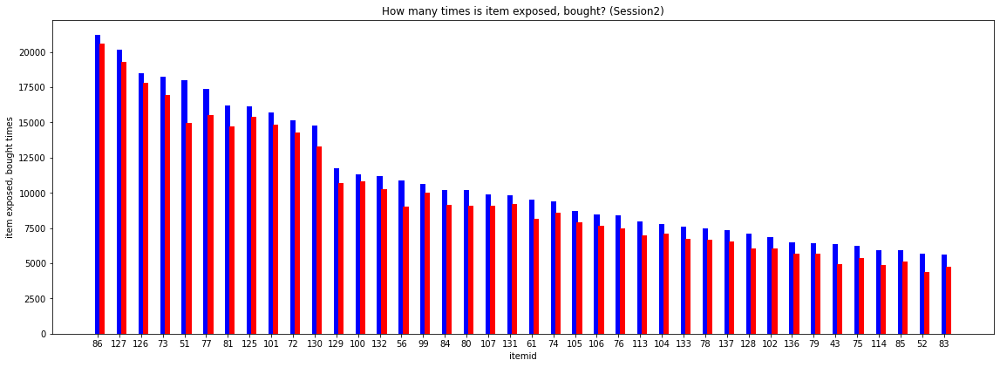

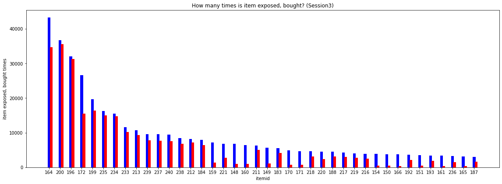

Sort by ratio


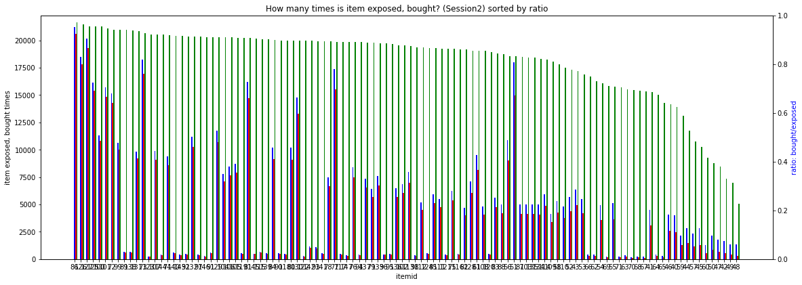

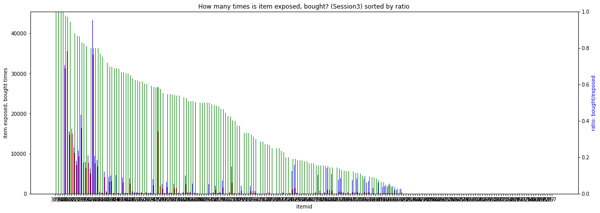

Top 40

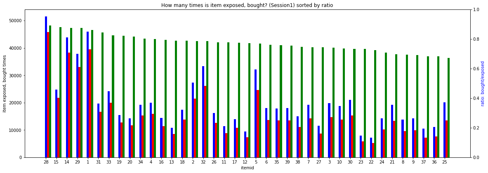

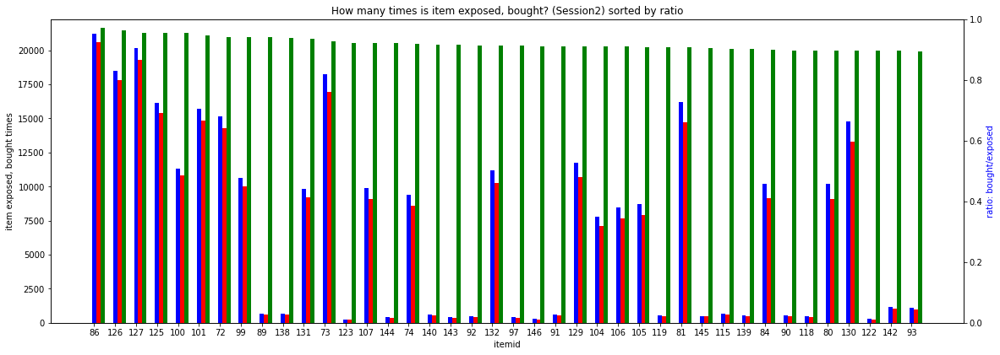

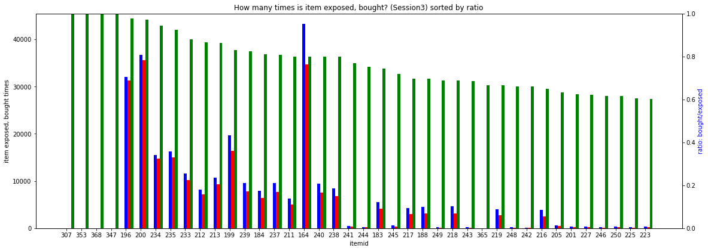


#### Bought vs Expose (expose算所有session的) by session

整体购买率


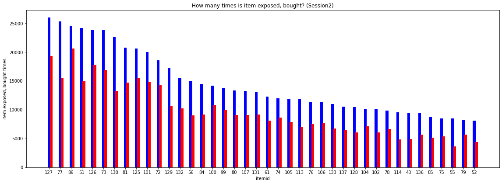

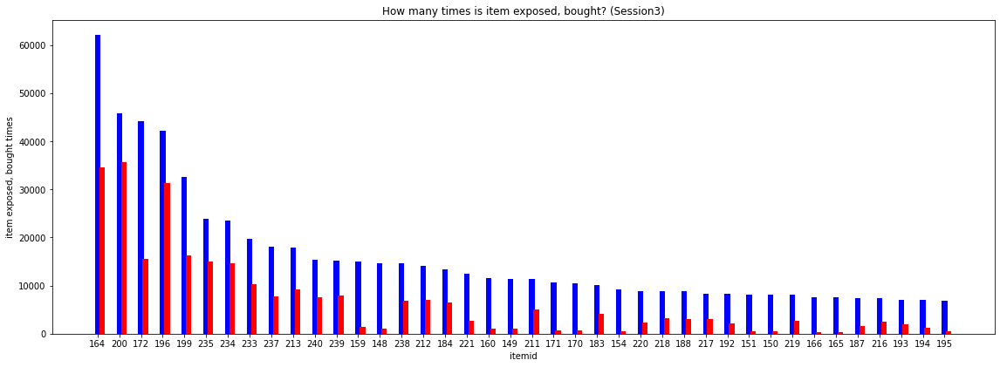

Sort by ratio


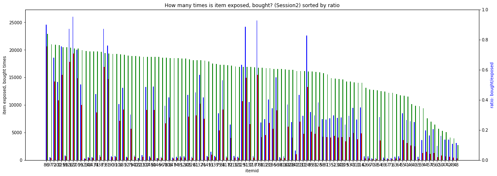

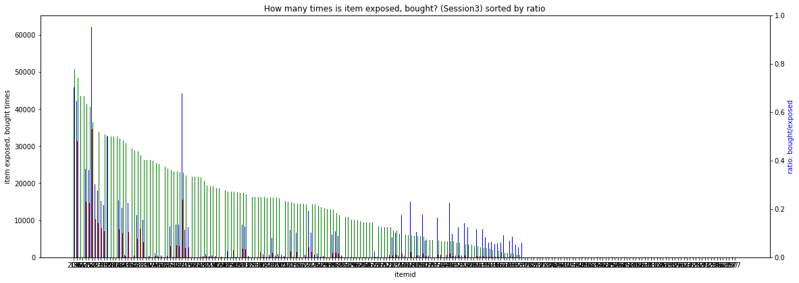

Top 40


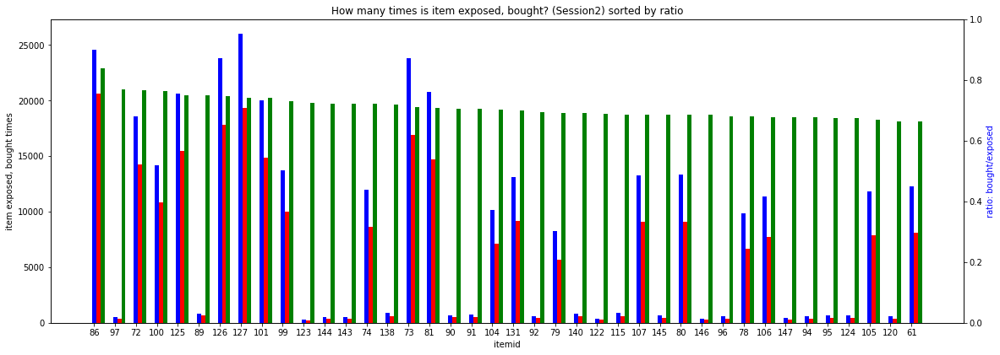

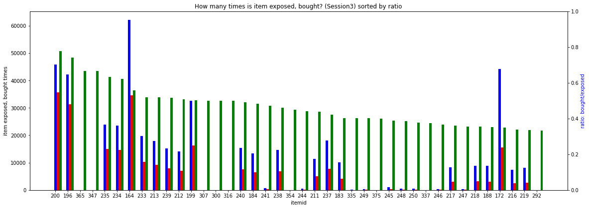


### User feature study (user_portrait)

*   每个人的portrait一定是10个
*   portrait的每一列都各自固定的含义

| user_portrait idx                  | 1    | 2    | 3    | 4    | 5    | 6    | 7    | 8    | 9    | 10   |
| ---------------------------------- | ---- | ---- | ---- | ---- | ---- | ---- | ---- | ---- | ---- | ---- |
| \# unique_values in trainset       | 3    | 1363 | 20   | 10   | 195  | 49   | 3    | 11   | 2    | 2164 |
| \# unique_values in testset_track1 | 3    | 1319 | 19   | 10   | 191  | 47   | 3    | 13   | 2    | 2054 |
| \# unique_values in testset_track2 | 3    | 1341 | 20   | 10   | 190  | 47   | 3    | 11   | 2    | 2060 |
| 解释                               |      |      |      |      |      |      |      |      |      |      |


| user portrait | train | test1 | test2 | train cnt                                                    |      |
| ------------- | ----- | ----- | ----- | ------------------------------------------------------------ | ---- |
| 1             | 3     | 3     | 3     | {'64054': 228758, '92265': 31229, '90378': 100}              |      |
| 2             | 1363  | 1319  | 1341  |                                                              |      |
| 3             | 20    | 19    | 20    | {'80911': 10241, '93755': 19876, '63021': 8352, '6599': 142601, '65544': 11115, '21966': 9418, '38156': 7801, '34810': 13339, '94578': 2342, '52700': 9753, '78388': 12225, '50177': 7765, '66367': 2848, '22789': 1617, '25312': 467, '53523': 97, '9945': 60, '63844': 34, '81734': 36, '77828': 100} |      |
| 4             | 10    | 10    | 10    | {'36504': 113502, '88510': 30999, '16721': 37025, '6400': 4784, '73143': 20250, '1354': 9121, '44932': 18193, '34611': 6826, '29565': 12406, '84616': 6981} |      |
| 5             | 195   | 191   | 190   |                                                              |      |
| 6             | 49    | 47    | 47    | {'7615': 91021, '20543': 34103, '37350': 28346, '40097': 1467, '11973': 39295, '44119': 14554, '93364': 20817, '63681': 7012, '54153': 13, '65360': 749, '27638': 39, '69075': 4127, '70783': 4311, '85441': 1775, '88933': 1081, '5483': 36, '38762': 507, '77998': 137, '51959': 1131, '80092': 1897, '39206': 1046, '87390': 192, '49967': 606, '21179': 391, '52399': 1943, '18673': 205, '43316': 481, '59842': 555, '31936': 249, '54002': 31, '81740': 154, '86550': 72, '40240': 221, '55646': 439, '52128': 291, '20159': 41, '20358': 469, '16913': 16, '36118': 9, '81202': 19, '44154': 2, '29198': 15, '51710': 31, '50715': 12, '7028': 35, '14107': 26, '66803': 14, '18306': 4, '53679': 100} |      |
| 7             | 3     | 3     | 3     | {'54240': 91021, '83978': 168966, '11354': 100}              |      |
| 8             | 11    | 13    | 11    | {'37294': 82493, '21927': 73113, '65505': 13456, '50138': 29042, '93716': 32114, '83395': 4035, '6560': 5388, '55172': 3448, '11606': 5335, '78349': 10419, '16279': 1244} |      |
| 9             | 2     | 2     | 2     | {'74820': 253950, '3031': 6137}                              |      |
| 10            | 2164  | 2054  | 2060  |                                                              |      |


### Item feature Study (item_vec)

| user_portrait idx             | 1       | 2                   | 3    | 4                                             | 5          |
| ----------------------------- | ------- | ------------------- | ---- | --------------------------------------------- | ---------- |
| \# unique_values in item_info | 4       | 10                  | 2    | 241                                           | 214        |
| sample                        | 1,2,3,4 | 0,1,2,3,4,5,6,7,8,9 | 1,2  | 0~1, float                                    | 0~1, float |
|                               |         |                     |      | 有一些特别大的outlier，待确定是不是数据有错误 |            |


```

```

